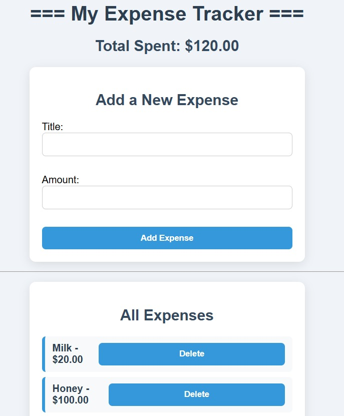

# 💸 Expense Tracker

A simple and beginner-friendly web app to track your daily expenses. Built using **HTML**, **CSS**, and **JavaScript** — no frameworks or complex libraries.

---

## 📌 Features

- Add and delete expense items
- Automatically updates total amount spent
- Stores data in your browser using **localStorage**
- Clean and responsive UI

---

## 🧠 Tech Stack

- HTML
- CSS
- JavaScript (Vanilla)
- LocalStorage API

---

## 📷 Preview

 <!-- Add a screenshot if you'd like -->

---

## 🚀 How to Run

1. Clone the repository  
